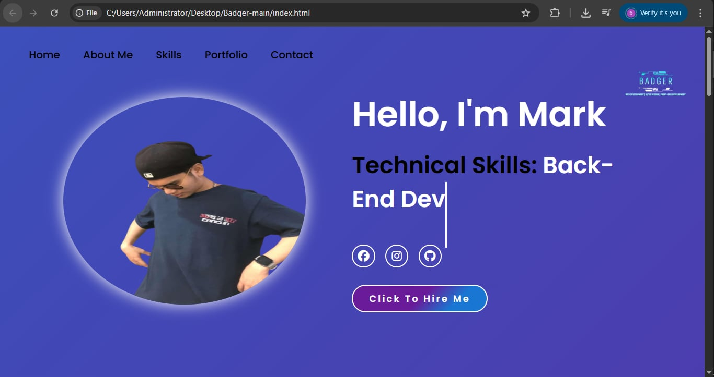

# 🦡 Badger Portfolio Website

> A personal portfolio website showcasing my journey as an Information Systems student, featuring my skills, projects, and creative work.

## ✨ Features

- 🎨 **Custom Design** - Unique "Badger" themed portfolio with personal branding
- 📱 **Responsive Layout** - Adapts seamlessly across all device sizes
- 🚀 **Contact Form Integration** - Functional contact form using Web3Forms API
- 🔗 **Social Media Integration** - Connected with Facebook, Instagram, and GitHub
- 💻 **Project Showcase** - Display area for my web development projects
- 🎯 **Clean Navigation** - Smooth scrolling sections for easy browsing

## 🛠️ Built With

- **HTML5** - Semantic structure and content
- **CSS3** - Custom styling and responsive design
- **Font Awesome 6.5.2** - Professional icons for social links and UI elements
- **Web3Forms API** - Backend-free contact form handling
- **Vanilla JavaScript** - Interactive elements and form validation

## 📁 Project Structure
badger-portfolio/
│
├── index.html # Main HTML file
├── style.css # Custom stylesheet
├── images/ # Image assets
│ ├── logo.png # Brand logo
│ ├── main.png # Hero section image
│ ├── favicon.ico # Browser favicon
│ ├── front-endshit.png
│ ├── java-icon.png
│ ├── project1.jpg
│ └── project2.jpg
└── README.md # Documentation
